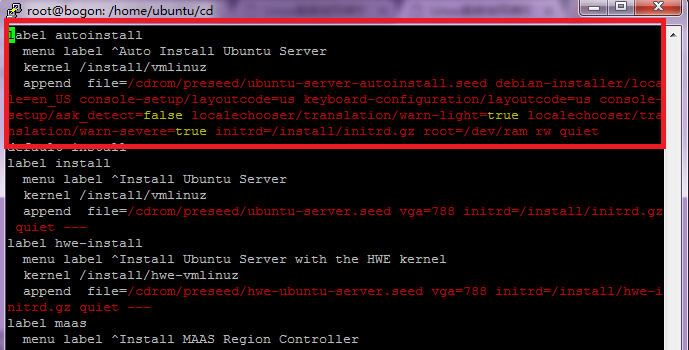
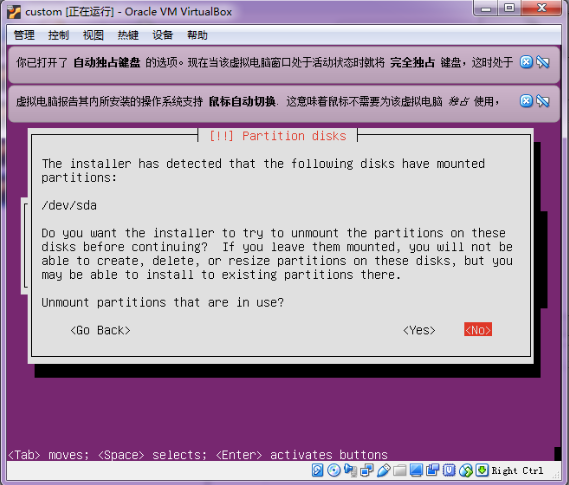
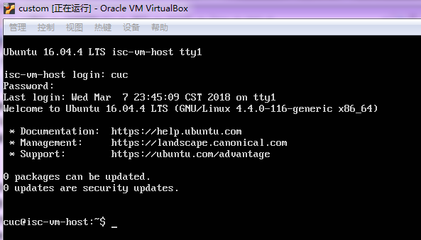
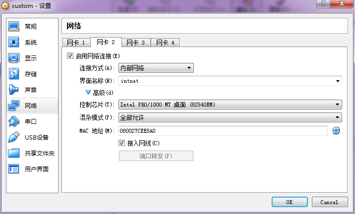
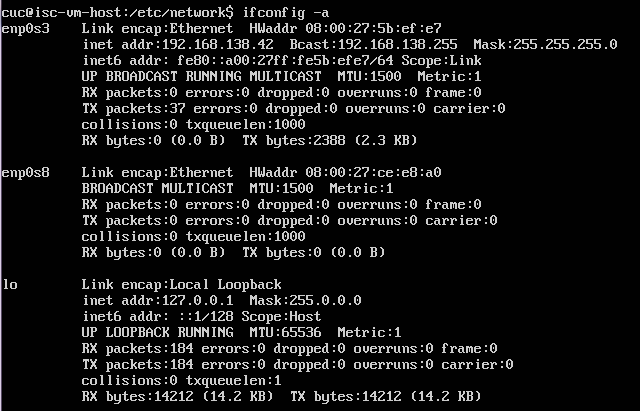
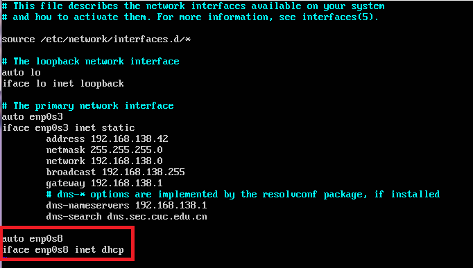
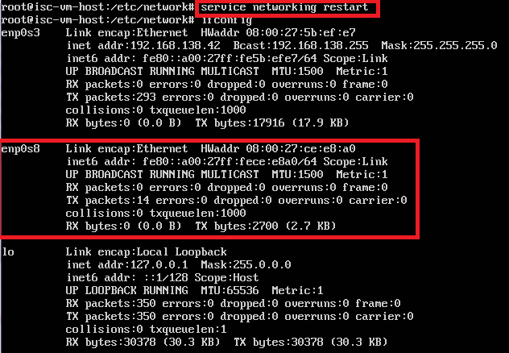
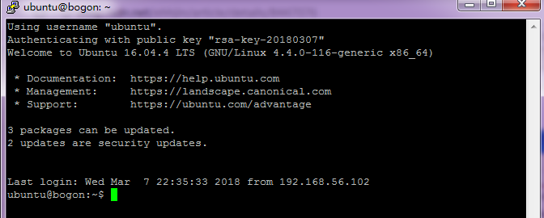

# 第一章:Linux基础（实验）  

## 无人值守Linux安装镜像制作

 - 使用sftp将iso镜像上传到虚拟机内   

 

 - 将光盘内容克隆到工作路径

```
 在当前用户目录下创建一个用于挂载iso镜像文件的目录     
 mkdir loopdir    

 挂载iso镜像文件到该目录   
 mount -o loop ubuntu-16.04.4-server-amd64.iso loopdir

  创建一个工作目录用于克隆光盘内容   
  mkdir cd   

  同步光盘内容到目标工作目录   
  一定要注意loopdir后的这个/，cd后面不能有/   
  rsync -av loopdir/ cd  

  卸载iso镜像   
  umount loopdir   
```    


- 编辑Ubuntu安装引导界面增加一个新菜单项入口   

```
进入目标工作目录
cd cd/

编辑文件txt.cfg,具体添加内容如下图所示
vim isolinux/txt.cfg
```   
   



- 将定制文件ubuntu-server-autoinstall.seed上传至目录~/cd/preseed/   


   

- 修改isolinux/isolinux.cfg，增加内容timeout 10   

   

- 重新生成md5sum.txt   


- 获得无人值守iso镜像   

    

- 通过sftp将custom.iso下载到本地   


- 使用custom.iso安装时发现，在Partition disks处还需要进行选择，并输入回车键。



- 对ubuntu-server-autoinstall.seed进行修改并重新生成镜像。（问题没有解决）   

   

- 成功安装   



## 新添加网卡自动获取IP   

- 添加内部网卡   

   

- 查看网卡信息   

   

- 配置文件`/etc/network/interfaces`   



- 重启网卡后再次查看网卡信息   



## ubuntu-server-autoinstall.seed与示例文档对比（左侧为ubuntu-server-autoinstall.seed）

- 选择支持的地点；跳过语言支持的选择   


- 设置链接等待时间为5秒；设置dhcp服务等待时间为5秒；开启手动配置网络   

   

- 设置静态IP地址、子网掩码、网关、名称服务器地址    


- 设置默认主机名、域名
- 强制主机名为`isc-vm-host`   


- 设置默认用户名和密码    


- 设置时区为上海
- 安装期间，不使用ntp设置时间  


- 对于LVM分区，选择尽可能多的空间
- 选择分区目录：/home /var/ tmp分离


- 安装`openssh-server`
- 在`debootstrap`之后不更新安装包
- 自动安装安全更新


## putty免密登录   

- 打开PUTTY.EXE，点击‘Generate’生成公私钥，保存私钥

- 在虚拟机根目录下创建‘.ssh’文件夹，将公钥写入该文件夹下的'authorized_keys'文件   

   

- 将私钥导入PUTTY，并填入登录用户名和连接IP，成功实现免密登录    

   

## 参考资料
[同学实验](https://github.com/CUCCS/2015-linux-public-RachelLYY/blob/labs/lab1/%E6%97%A0%E4%BA%BA%E5%80%BC%E5%AE%88Linux%E5%AE%89%E8%A3%85%E9%95%9C%E5%83%8F%E5%88%B6%E4%BD%9C.md)
